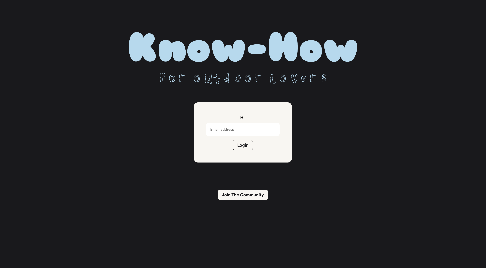

# Know-How! An Outdoor Lovers Application 
Please note that Know-How and Know-How for now have been used interchangeably. 

## Description 

Know-How is an organization curating events and classes for outdoors lovers and the outdoors curious. The website curates experiences designed to connect participants back to nature and build community through a shared love of the outdoors. This application merges the healing power of nature with education. Know-How offers weekly workshops and activities to anyone interested in the outdoors, regardless of experience. For those who may want to start a new outdoor hobby but aren’t sure how, Know-How provides an inclusive environment for learning and adventuring.

## Wireframe & ERD 

https://miro.com/app/board/uXjVMn0oef4=/?share_link_id=873923352855
https://dbdiagram.io/d/64f8fce902bd1c4a5e1b5ca1

## Description of the user

The student user of this application is an individual who has a genuine passion for the outdoors and nature. They may already have experience with outdoor activities and are interested in deepening their connection with nature, learning new outdoor skills, and participating in community events and workshops.

The teachers are users that are experienced in outdoor activities and possess a specialized knowledge and want to share their expertise and passion with others. 

## List of Features 

- User specific views based on validation 
- CRUD capabilities 

## Screenshots of Project 

